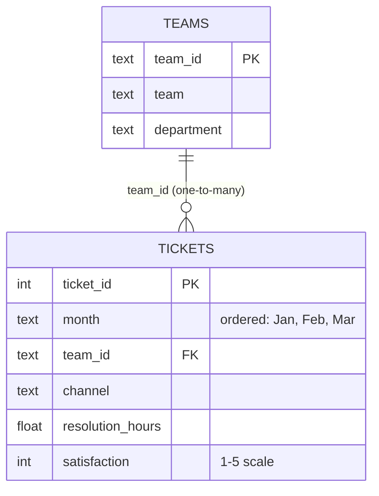
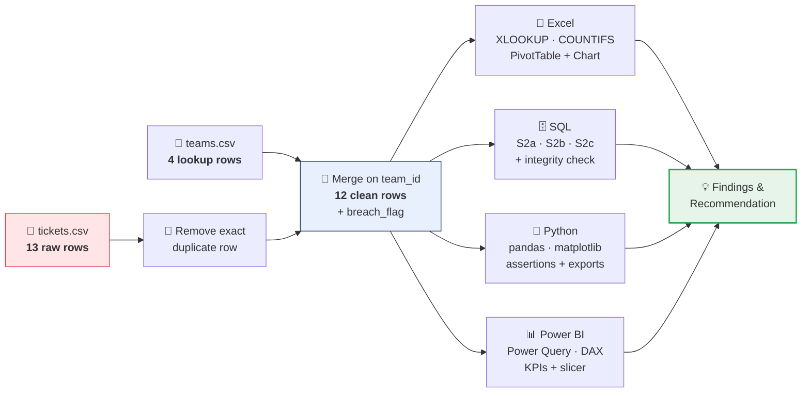
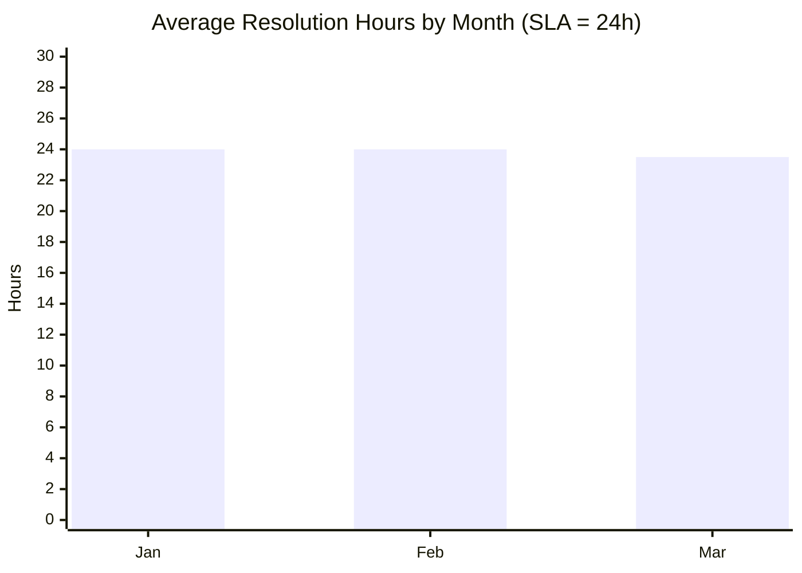

<!-- ═══════════════════════ ANIMATED HEADER ═══════════════════════ -->


<!-- Typing animation -->
<p align="center">
  <a href="https://git.io/typing-svg">
    
  </a>
</p>

<!-- Badges -->
<p align="center">
  
  
  
  
</p>

<p align="center">
  
  
  
  
  
  
</p>

<!-- Navigation buttons -->
<p align="center">
  <a href="#-plain-english"></a>
  <a href="#-results"></a>
  <a href="#-how-to-run"></a>
  <a href="#-video"></a>
</p>


## 👤 Project Identity

| Field | Detail |
|---|---|
| **Project Title** | Customer Support Quality Analysis |
| **Student Name** | Devanshi |
| **Student ID** | 10775 |
| **Assigned Set** | **Set B** |
| **Institution** | Red & White Skill Education |
| **Exam Type** | Practical — Data Analysis (3 Hours) |
| **Repository** | [Data_Analysis_Set_B_10775](https://github.com/DevanshiCodesAI/Data_Analysis_Set_B_10775) |


## 🗣️ Plain English

> **New to data analysis? Read this box first — no jargon, promise.**

Imagine a company with **4 support teams** answering customer questions through **3 doors**: 📧 Email, 💬 Chat, and 📞 Phone.

Every time a customer asks for help, the company opens a **ticket** — like a parcel tracking slip. Each slip records three things: **which month** it happened, **how many hours** it took to fix, and **how happy** the customer was afterwards (a score out of 5).

The company has one promise: **"We fix every problem within 24 hours."** Any ticket that takes *longer* than 24 hours is a broken promise — called an **SLA breach** (SLA = Service Level Agreement, the promise).

**This project answers two simple business questions:**

1. 🎯 **Which team breaks the 24-hour promise most often?** → That's the team that needs training or more staff.
2. 🎯 **Which "door" (Email / Chat / Phone) gives customers the best experience?** → So the company knows where to send urgent problems.

To answer honestly, I checked the same data **four different ways** — Excel, a database (SQL), Python code, and an interactive dashboard (Power BI) — and confirmed all four tools give the **same answers**. That's like asking four different accountants to check the same books. ✅


## 🎯 Business Objective & Questions

**Objective:** Measure resolution performance and service quality across support teams and contact channels, so management can target improvement where it matters most.

| # | Business Question | Short Answer (details in [Results](#-results)) |
|---|---|---|
| **Q1** | Which support team should improve resolution performance? | **Technical department** — 50.00% SLA breach rate, avg 28.33 hrs/ticket (vs Service: 33.33%, 19.33 hrs). **BillingHelp (T2)** and **AppSupport (T3)** are tied worst at 66.67% breach rate. |
| **Q2** | How does service quality vary by channel? | **Email is the strongest channel** (0.00% breaches, 4.00/5 satisfaction). **Chat is the weakest** (75.00% breaches, 3.25/5 satisfaction). |


## 📂 Datasets & Data Dictionary

Two synthetic CSV files are supplied in `data/raw/` and used **unchanged** as the raw source.

### 🎫 `data/raw/tickets.csv` — Fact file (13 rows → 12 after cleaning)

| Column | Type | Meaning |
|---|---|---|
| `ticket_id` | Integer | Unique ticket identifier (primary key) |
| `month` | Text (ordered) | Month of resolution — ordered **Jan → Feb → Mar** in all charts |
| `team_id` | Text | Foreign key linking to `teams.csv` |
| `channel` | Text | Contact channel: Email / Chat / Phone |
| `resolution_hours` | Numeric | Hours taken to resolve the ticket |
| `satisfaction` | Numeric (1–5) | Customer satisfaction score |

### 👥 `data/raw/teams.csv` — Lookup file (4 rows)

| Column | Type | Meaning |
|---|---|---|
| `team_id` | Text | Unique team identifier (primary key) |
| `team` | Text | Team name (AccountCare, BillingHelp, AppSupport, DeviceHelp) |
| `department` | Text | Owning department (Service or Technical) |

### 🔗 Data Model — one team, many tickets




## 🧹 Cleaning Steps & Metric Definitions

**Cleaning (applied identically in all four tools):**
- ✅ The fact file contains **one intentional exact duplicate** (`ticket_id = 12`). It is removed in every module: **13 raw rows → 12 unique records**.
- ✅ Data types enforced: `ticket_id` integer; `resolution_hours` & `satisfaction` numeric; text fields as text.
- ✅ Validation: every `team_id` in tickets matches a lookup row (**zero unmatched keys**, verified via SQL `LEFT JOIN` diagnostic and Python assertion).

**Metric definitions (used everywhere, no exceptions):**

| Metric | Rule / Formula |
|---|---|
| `breach_flag` | `1` when `resolution_hours > 24`, else `0`. **Exactly 24 hours MEETS the SLA.** |
| **SLA Breach Rate** | `tickets resolved in > 24 hrs ÷ all tickets` — calculated **from counts**, never by averaging subgroup percentages; displayed as a percentage |
| **Rounding** | All numeric results reported to **2 decimal places**; ties are reported for all tied entities |


## 🛠️ Tools & Versions

| Tool | Version | Used For |
|---|---|---|
| Microsoft Excel | Microsoft 365 | Raw → Clean → Lookup → Summary sheets, XLOOKUP, COUNTIFS, PivotTable |
| Power BI Desktop | Latest (Windows) | Power Query cleaning, DAX measures, one-page report |
| MySQL | 8.0.x <!-- ✏️ confirm your exact version --> | Schema, constraints, 3 analytical queries |
| Python | 3.x | pandas + matplotlib analysis |
| Git / GitHub | — | Version control & submission |

> ✏️ *Update the SQL engine and exact versions above to match your lab machine (the exam asks you to state them).*


## 🗺️ Repository Structure

```
Data_Analysis_Set_B_10775/
│
├── 📄 README.md                    ← You are here
├── 📄 requirements.txt             ← Python packages (pandas, matplotlib)
├── 📄 .gitignore                   ← Excludes environments, caches, credentials
│
├── 📁 data/raw/
│   ├── tickets.csv                 ← Raw fact file (13 rows incl. duplicate)
│   └── teams.csv                   ← Lookup file (4 rows)
│
├── 📁 excel/
│   └── analysis.xlsx               ← Raw | Lookup | Clean | Summary (live formulas + PivotTable)
│
├── 📁 sql/
│   ├── setup.sql                   ← CREATE TABLE + INSERT (12 fact + 4 lookup rows)
│   └── queries.sql                 ← S2a, S2b, S2c labeled queries + diagnostic
│
├── 📁 python/
│   └── analysis.py                 ← Load → clean → merge → derive → plot → export
│
├── 📁 powerbi/
│   └── dashboard.pbix              ← Power Query cleaned, DAX measures, 1-page report
│
└── 📁 outputs/
    ├── clean_data.csv              ← Merged 12-row clean dataset (Python)
    ├── python_summary.csv          ← Grouped breach-rate summary (Python)
    ├── python_chart.png            ← Monthly avg resolution chart
    ├── powerbi_dashboard.png       ← Dashboard screenshot (unfiltered)
    └── 📁 sql/                     ← Saved results of S2a, S2b, S2c (CSV/TXT)
```


## 🔄 End-to-End Workflow




## 🚀 How to Run

### 1️⃣ SQL (run in this exact order)

```bash
# Dialect: MySQL 8.0 — execution order matters!
mysql -u <user> -p < sql/setup.sql      # ① creates tables, keys, loads 12 + 4 rows
mysql -u <user> -p < sql/queries.sql    # ② runs S2a, S2b, S2c + integrity diagnostic
```

| Query | What it returns |
|---|---|
| **S2a** | Average resolution time by department (JOIN, ordered DESC) |
| **S2b** | Teams whose average `resolution_hours` exceeds 24 (GROUP BY + HAVING) |
| **S2c** | Top 2 channels by breach count (`resolution_hours > 24`, ties broken alphabetically) |
| **Diagnostic** | `LEFT JOIN` teams→tickets confirming **zero unmatched keys** |

Saved results live in `outputs/sql/`.

### 2️⃣ Python

```bash
pip install -r requirements.txt
python python/analysis.py        # run from the repository root — all paths are relative
```

The script: loads both CSVs → drops the exact duplicate → **asserts 12 rows & zero unmatched `team_id`** → builds `breach_flag` → prints department & team summaries (with breach numerator/denominator) → saves the chart and two CSVs to `outputs/`.

### 3️⃣ Excel — `excel/analysis.xlsx` sheet guide

| Sheet | What it does |
|---|---|
| **Raw** | Original 13-row tickets data, unchanged (before count = 13) |
| **Lookup** | The 4-row teams data |
| **Clean** | Duplicate removed (after count = **12**) + `department` via **XLOOKUP** on `team_id` + `breach_flag` via `=IF(resolution_hours>24,1,0)` |
| **Summary** | **COUNTIFS** breach counts by channel + **PivotTable** (avg resolution by department × month, Jan→Feb→Mar) + column chart |

> ⚠️ All formulas and the PivotTable are **live/editable** — not screenshots.

### 4️⃣ Power BI — refresh after cloning

1. Open `powerbi/dashboard.pbix` → **Home → Transform data → Data source settings**.
2. Select each CSV → **Change Source…** → browse to your cloned `data/raw/` folder → OK.
3. **Close & Apply**, then **Refresh**. Both queries reload (12 tickets, 4 teams) and all visuals update.


## 📊 Results

### Headline KPIs (all 12 clean tickets, unfiltered)

| 🎫 Tickets | ⏱️ Avg Resolution | 😊 Avg Satisfaction | 🚨 SLA Breach Rate |
|:---:|:---:|:---:|:---:|
| **12** | **23.83 hrs** | **3.58 / 5** | **41.67%** (5 of 12) |

### By Department (Q1)

| Department | Tickets | Breaches | Breach Rate | Avg Resolution (hrs) | Avg Satisfaction |
|---|:---:|:---:|:---:|:---:|:---:|
| Service | 6 | 2 | 33.33% | **19.33** | 3.83 |
| **Technical** ⚠️ | 6 | 3 | **50.00%** | **28.33** | 3.33 |

### By Team — who needs to improve?

| Team | Department | Tickets | Breaches | Breach Rate | Avg Resolution (hrs) |
|---|---|:---:|:---:|:---:|:---:|
| AccountCare (T1) | Service | 3 | 0 | 0.00% | 12.00 |
| **BillingHelp (T2)** ⚠️ | Service | 3 | 2 | **66.67%** | 26.67 |
| **AppSupport (T3)** ⚠️ | Technical | 3 | 2 | **66.67%** | 28.67 |
| DeviceHelp (T4) | Technical | 3 | 1 | 33.33% | 28.00 |

### By Channel (Q2)

| Channel | Tickets | Breaches | Breach Rate | Avg Resolution (hrs) | Avg Satisfaction |
|---|:---:|:---:|:---:|:---:|:---:|
| **Email** ✅ | 4 | 0 | **0.00%** | 18.00 | **4.00** |
| **Chat** ⚠️ | 4 | 3 | **75.00%** | 27.00 | 3.25 |
| Phone | 4 | 2 | 50.00% | 26.50 | 3.50 |

### Monthly trend (avg resolution hours)




## 💡 Findings & Recommendation

> **Finding 1 — Technical is the department that must improve.** Technical resolves tickets in **28.33 hours** on average with a **50.00% SLA breach rate** (3 of 6), versus Service's **19.33 hours** and **33.33%** (2 of 6). Within teams, **BillingHelp (T2)** and **AppSupport (T3)** tie for the worst breach rate at **66.67%** (2 of 3 tickets each).

> **Finding 2 — Service quality varies sharply by channel.** **Chat breaches the SLA on 75.00%** of its tickets (3 of 4) with the lowest satisfaction (**3.25/5**), while **Email breaches 0.00%** with the highest satisfaction (**4.00/5**). Phone sits in between (50.00% breach, 3.50/5).

> **✅ Recommendation:** Prioritise a resolution-time intervention for the **Technical department — starting with AppSupport (T3) and BillingHelp (T2)** — and review the **Chat channel workflow** (staffing, scripts, escalation rules), since Chat combines the worst breach rate with the weakest satisfaction. *Limitation: with only 12 tickets (3 per team, 4 per channel), results are directional, not statistically conclusive — a larger sample is needed before structural changes.*


## 🔗 Cross-Tool Reconciliation

The same aggregate was computed independently in **all four tools** and matches exactly:

| Aggregate | 📗 Excel | 🗄️ SQL | 🐍 Python | 📊 Power BI |
|---|:---:|:---:|:---:|:---:|
| **Avg resolution_hours — Technical dept** | 28.33 (PivotTable) | 28.33 (S2a) | 28.33 (groupby summary) | 28.33 (card, dept filter) |
| **Overall SLA breach rate** | 41.67% (COUNTIFS 5/12) | 41.67% | 41.67% | 41.67% (KPI card) |

*Rounding note: all tools agree to 2 decimal places; no rounding differences observed.*

<details>
<summary>🔍 <b>Click to expand:</b> Power BI slicer test (channel = Chat)</summary>

With the channel slicer set to **Chat**, the KPI cards respond simultaneously: Ticket Count = **4**, Avg Satisfaction = **3.25**, SLA Breach Rate = **75.00%**. Clearing the slicer restores the unfiltered state (12 / 3.58 / 41.67%). ✅

</details>


## 🎥 Video

<p align="center">
  <a href="https://drive.google.com/file/d/1xVauKxz3QA5AD74njvLWzrnOzI3YDgIB/view?usp=sharing">
    
  </a>
</p>

| 🎬 Duration | 🔗 Link | 📋 Contents |
|:---:|---|---|
| **X min XX sec** <!-- ✏️ e.g. 7 min 30 sec --> | [Unlisted YouTube / Drive link](https://PASTE-YOUR-VIDEO-LINK-HERE) | Face + screen walkthrough of all 4 modules, findings & recommendation |

> ⚠️ Link tested in a signed-out/private browser window before submission.

## 🖼️ Demo Gallery

<p align="center">
  <br/>
  <em>Power BI one-page report — KPI cards, department chart, monthly trend, channel slicer</em>
</p>

<p align="center">
  <br/>
  <em>Python (matplotlib) — monthly average resolution hours, Jan → Feb → Mar</em>
</p>

<!-- ✏️ OPTIONAL: record a short GIF of you clicking the Power BI channel slicer
     (ScreenToGif is free) and save it as docs/demo_slicer.gif, then uncomment: -->
<!-- <p align="center">
  
</p> -->


## 📚 References

- Course materials & practical exam brief — Red & White Skill Education (Set B)
- [pandas documentation](https://pandas.pydata.org/docs/) · [matplotlib documentation](https://matplotlib.org/stable/contents.html)
- [Microsoft DAX reference](https://learn.microsoft.com/en-us/dax/) · [MySQL 8.0 reference](https://dev.mysql.com/doc/)
- README visuals: [capsule-render](https://github.com/kyechan99/capsule-render), [readme-typing-svg](https://github.com/DenverCoder1/readme-typing-svg), [shields.io](https://shields.io)

## ✍️ Authorship Declaration

> **"All work in this repository is my own except where cited."**
> — *Devanshi, Student ID 10775, Set B*

<br/>

<p align="center">
  <a href="#-project-identity"></a>
</p>

<!-- ═══════════════════════ ANIMATED FOOTER ═══════════════════════ -->

